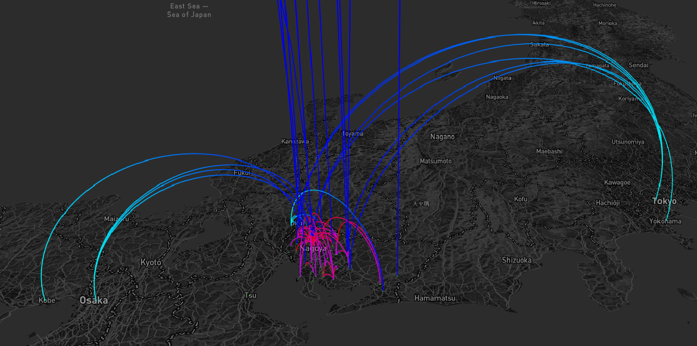
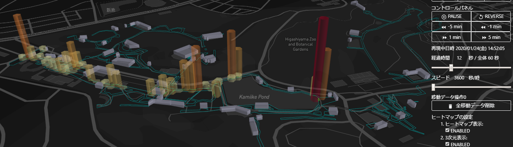

# HarmoVIS_client
Harmoware-VIS client for Synerex using Electron

# Installation

You can download installers from https://github.com/synerex/HarmoVIS_client/releases

Just install them. Then you need to obtain Mapbox access token.

Now, you can enjoy HarmoVIS_client.

Pushing "MapWin" button displays Map window.

Several buttons below are DEMO button.

## インストール：
日本語ドキュメントは以下にあります。（ちょっと古い）

https://s-mobi01.github.io/SynerexHarmVizCli

#How to build
  yarn
  yarn build

#How to make distribution package

You have to copy your own synerex-server, harmovis-layers, nodeserv into synerex directory
  mkdir synerex
  cp [youbindir]harmovis-layers synerex
  yarn dist-mac

  yarn dist-win

